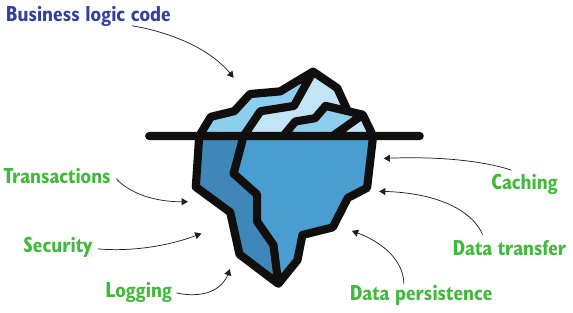
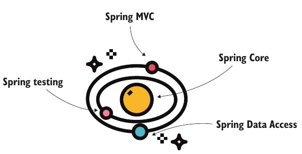
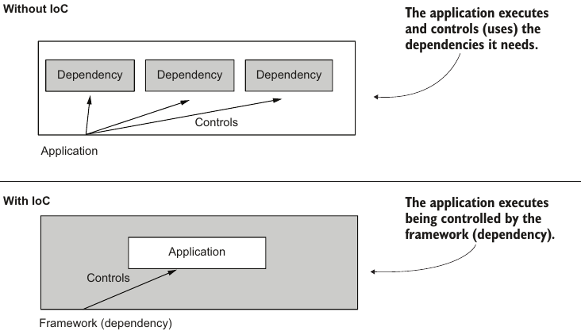

# Chapter 1. Spring in the real world

- The Spring framework is an application framework that is part of the Java ecosystem.
- An application framework is a set of common software functionalities that provides a foundation structure for developing an application.

## 1.1 Why should we use frameworks?

- Using frameworks saves money and time of typing common set of functionalities like: logging, caching, security, etc.

  

- Choosing and using a framework is linked to the design and architecture of an application.

## 1.2 The Spring ecosystem

- You can imagine the Spring framework as a solar system, where Spring Core represents the star in the middle, which holds all the framework together.

  

-  Inversion of control. Instead of executing its own code, which makes use of several other dependencies, in case of an IoC scenario, the app execution is controlled by the dependency. The Spring framework controls an app during its execution. Therefore, it implements an IoC scenario of execution.

  

## 1.4 When not to use frameworks

- You need to implement a particular functionality with a footprint as small as possible. By footprint, I mean the storage memory occupied by the app’s files.
- Specific security requirements force you to implement only custom code in your app without making use of any open source framework.
- You’d have to make so many customizations over the framework that you’d write more code than if you’d simply not used it at all.
- You already have a functional app, and by changing it to use a framework you don’t gain any benefit.
