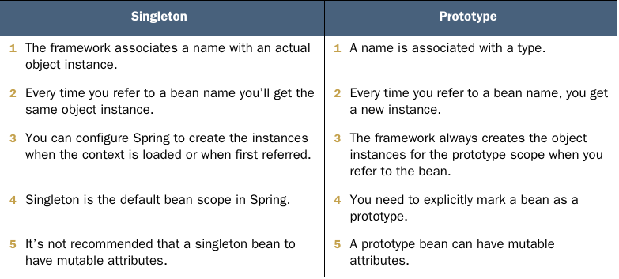

# Chapter 5. The Spring context: Bean scopes and life cycle

- The singleton bean scope defines Spring’s default approach for managing the beans in its context.
- Spring creates a singleton bean when it loads the context and assigns the bean a name (sometimes also referred to as bean ID).
  - We name this scope singleton because you always get the same instance when you refer to a specific bean.
  - In Spring, singleton means unique per name not unique per app.
- Make an object bean in the Spring context only if you need Spring to manage it so that the framework can augment that bean with a specific capability. If the object doesn’t need any capability offered by the framework, you don’t need to make it a bean.
- If you need to make an object bean in the Spring context, it should be singleton only if it’s immutable Avoid designing mutable singleton beans.
- If a bean needs to be mutable, an option could be to use the prototype scope.
- With lazy instantiation, Spring doesn’t create the singleton instances when it creates the context. Instead, it creates each instance the first time someone refers to the bean.
- The @Lazy annotation tells Spring that it needs to create the bean only when someone refers to the bean for the first time.
- A quick comparison between singleton and prototype bean scopes

  

